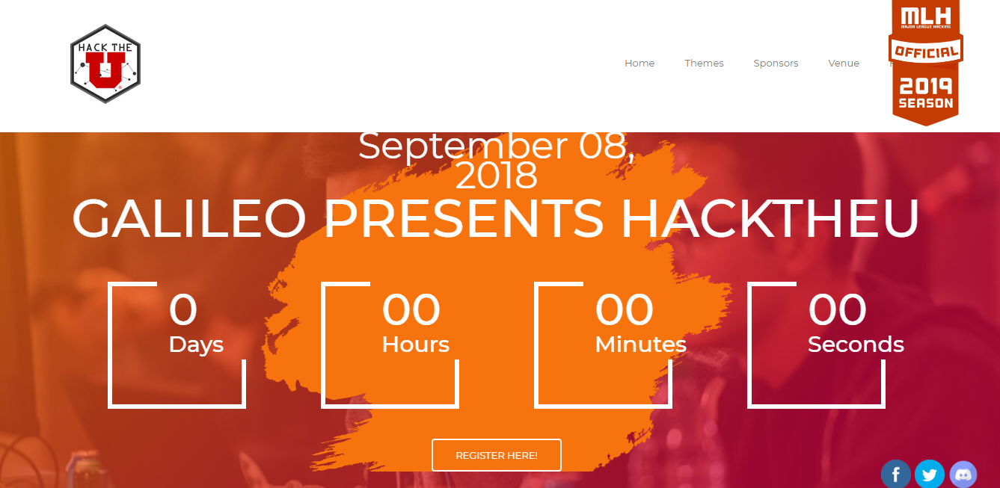

# Website Inspirations for future reference

## [ng-India](http://www.ng-ind.com/)

- *CODE DEPLOYED* illustration

## [hack-sheffield](https://hacksheffield.co)

- *VIDEO* AS BACKGROUND

- *GLOBALTECHTALKS BANNER* IN NAV BAR

## HACK THE NORTH

- *CODING PHRASES* illustration

- *SCHEDULE* on landing page

- *INNOVATIVE SPONSORS MENTION*

- *ROTATING GEARS* illustration

## [HACK THE NORTH 2017](https://2017.hackthenorth.com/)

- *SOME CUSTOM QUOTE BY JUDGES*

## [MEDHACKS](http://medhacks.org/2018/)

- *PROGRESSION BAR* IN NAV BAR

- *A CUTE MASCOT WITH A BACKSTORY*

- *CAMPUS AMBASSADORS MENTION*

##### can also have HALL OF FAME FOR AMBASSADORS

## [HACK THE U](https://hacktheu.com/)

- *COUNTDOWN TIMER*

- *FAQs SECTION WITH A FORM*

- *PERSISTENT SOCIAL MEDIA BUTTONS*

## Add more here

## [SITE TITLE] (LINK TO SITE)

- *WHAT YOU LIKE IN THERE*

